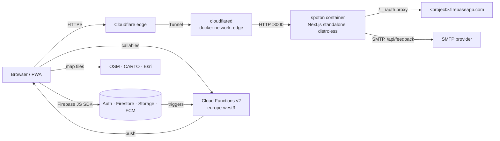

# SpotOn - Discover & Share Hidden Gems

> **Live:** https://spoton.isolapaul.hu

SpotOn is a mobile-first Progressive Web App for discovering and sharing places ("spots") on a map.
Users sign in with Google or email, add spots with photos, review and favourite them, and level up by contributing; admins approve new spots.
The web app runs as a hardened Docker container on a home server behind Cloudflare, and Firebase (Auth, Firestore, Storage, Cloud Messaging, Cloud Functions) is the backend.
The UI is available in Hungarian (default), English and German.

---

## Features

- Interactive Leaflet map (OpenStreetMap, CARTO and Esri tiles) with category emoji markers, GPS location and 5 map themes (Standard, Light, Dark, Silver, Satellite).
- Discovery panel: sort spots by nearest or best rated, filter by 9 categories.
- Add spots with up to 20 photos, compressed in the browser before upload.
- New spots stay pending until an admin approves them; spots added by admins are approved immediately.
- Photo galleries: other users can add photos to a spot and like individual images.
- 5-star reviews with comments and an average rating per spot.
- Favourites list and your own spots grouped by status (approved / pending).
- Profiles with photo, banner and a unique username (claimed server-side).
- Levels 1-5 based on spots created (3 / 10 / 15 / 20); perks are name colours, 7-day spot highlights (level 3+) and a custom name colour and font (level 5). Spot counts, highlights and name styles are checked by Cloud Functions.
- Push notifications (Firebase Cloud Messaging) for approvals, new reviews, favourites and, for admins, new pending spots, with per-type settings and an in-app notification centre.
- Role-based admins stored in `admins/{uid}`: admins approve or delete spots; the super admin (`role: 'super'`) adds and removes admins through Cloud Functions.
- Feedback form (message plus up to 3 screenshots) delivered by email; in-app patch notes.
- Installable PWA with iOS safe-area support and navigation hand-off to Google Maps / Apple Maps.

---

## Architecture



- The container serves the Next.js 16 App Router app (`src/app`) and three API routes: `/api/feedback` (SMTP), `/api/firebase-messaging-sw` (generated FCM service worker) and `/api/health`. It is stateless; all data lives in Firebase.
- The browser talks to Firebase directly through the JS SDK. `/__/auth/*` is proxied to `<project>.firebaseapp.com`, so the sign-in redirect runs on the app's own domain.
- Cloud Functions (`functions/`) hold the server-side logic: admin management, usernames, likes, image additions, highlights, profile mirrors and notifications.
- **Authorization is enforced by the Firestore/Storage rules (`firestore.rules`, `storage.rules`) and Cloud Functions, never by the UI.** UI checks are only for user experience.
- Cloudflare terminates TLS; the container publishes no host ports and is reachable only by `cloudflared` on the docker network `edge`.

---

## Local development

**Prerequisites:** Node 22 (see `.nvmrc`) and Java 21 (for the Firebase emulators).

```bash
git clone https://github.com/isolapaul/SpotOn.git
cd SpotOn
npm ci
```

Create `.env.local` with the build-time `NEXT_PUBLIC_FIREBASE_*` values and, if you want to test the feedback form, the runtime `SMTP_*` / `FEEDBACK_RECIPIENT` values (see [Environment variables](#environment-variables)). Never commit it.

```bash
npm run dev          # http://localhost:3000
```

### Against the emulators (no real Firebase project)

The emulator ports are configured in `firebase.json` (Auth 9099, Firestore 8080, Storage 9199, Functions 5001). The project id is always `demo-spoton`.

```bash
# terminal 1: emulators (functions need a build first)
npm --prefix functions ci && npm --prefix functions run build
npx firebase emulators:start --only auth,firestore,storage,functions --project demo-spoton

# terminal 2 (optional): seed the E2E fixtures
FIRESTORE_EMULATOR_HOST=127.0.0.1:8080 FIREBASE_AUTH_EMULATOR_HOST=127.0.0.1:9099 npx tsx scripts/seed-emulator.ts

# terminal 3: the app, connected to the emulators
NEXT_PUBLIC_USE_EMULATORS=1 \
NEXT_PUBLIC_FIREBASE_API_KEY=demo-key \
NEXT_PUBLIC_FIREBASE_AUTH_DOMAIN=demo-spoton.firebaseapp.com \
NEXT_PUBLIC_FIREBASE_PROJECT_ID=demo-spoton \
NEXT_PUBLIC_FIREBASE_STORAGE_BUCKET=demo-spoton.appspot.com \
NEXT_PUBLIC_FIREBASE_MESSAGING_SENDER_ID=0 \
NEXT_PUBLIC_FIREBASE_APP_ID=demo-app \
NEXT_PUBLIC_FIREBASE_VAPID_KEY=demo-vapid \
npm run dev
```

The automated suites start the emulators themselves: `npm run test:e2e` (Playwright, via `firebase emulators:exec`; it also seeds them with `scripts/seed-emulator.ts`) and `npm run test:rules` (Firestore/Storage emulators only).
To run a single E2E spec, and for the sandbox caveats, see [`CLAUDE.md` §4](CLAUDE.md#4-commands).

---

## Scripts

| Script | Purpose |
|---|---|
| `npm run dev` | Next.js dev server on port 3000 |
| `npm run build` | Production build (standalone output) |
| `npm start` | Serve the production build |
| `npm run lint` | ESLint |
| `npm run typecheck` | `tsc --noEmit` |
| `npm test` | Unit tests (Vitest) |
| `npm run verify` | typecheck + lint + unit tests + build: the gate for every change |
| `npm run verify:fn` | Functions build + lint + unit tests |
| `npm run test:e2e` | Builds the functions, starts the Auth/Firestore/Storage/Functions emulators, seeds them and runs Playwright |
| `npm run test:rules` | Firestore/Storage rules tests on the emulators (Java 21) |
| `npm run functions:build` | Build the Cloud Functions |
| `npm run functions:deploy` | `firebase deploy --only functions`: Paul only, see [`docs/security-rollout.md`](docs/security-rollout.md) |
| `npm run functions:logs` | `firebase functions:log` |

Cloud Functions (`npm --prefix functions run <script>`): `build`, `build:watch`, `lint`, `test`, `serve` (build + functions emulator), `shell`, `start`, `deploy`, `logs`. See [`functions/README.md`](functions/README.md).

---

## Environment variables

| Variable | Phase | Secret? | Set where (dev / container / Vercel) | Used by |
|---|---|---|---|---|
| `NEXT_PUBLIC_FIREBASE_API_KEY`, `…_AUTH_DOMAIN`, `…_PROJECT_ID`, `…_STORAGE_BUCKET`, `…_MESSAGING_SENDER_ID`, `…_APP_ID`, `…_VAPID_KEY` | build | no (public config) | `.env.local` / GitHub repo **variables** → Docker build args / Vercel env | `lib/firebase.ts`, SW route, push hook (`usePushNotifications`, `useUserStore`), `next.config.mjs`; `…_PROJECT_ID` also `/api/feedback` (ID-token check) |
| `NEXT_PUBLIC_FIREBASE_AUTH_DOMAIN` (note) | build | no | container: `spoton.isolapaul.hu` (D6); Vercel: `<project>.firebaseapp.com`; dev: `localhost` or firebaseapp | Auth |
| `NEXT_PUBLIC_USE_EMULATORS` | build | no | tests/dev only; rejected by the container build | `lib/firebase.ts`, CSP |
| `NEXT_PUBLIC_MOVED_TO` | build | no | Vercel only (T19); rejected by the container build | `MovedBanner` |
| `SMTP_HOST`, `SMTP_PORT`, `SMTP_USER`, `SMTP_PASS` | runtime | `SMTP_PASS` yes | `.env.local` / `/srv/docker/spoton/.env` (chmod 600) / Vercel env | `/api/feedback` |
| `FEEDBACK_RECIPIENT` | runtime | no (personal) | same as SMTP; required, else 503 | `/api/feedback` |
| `APP_URL` (functions param) | functions deploy | no | Firebase functions params | notification links |
| `NEXT_DIST_DIR` | build | no | E2E only (T04, `.next-e2e`) | `next.config.mjs` `distDir` |
| `VERCEL` | runtime | no | set automatically by Vercel only; switches `/api/feedback` IP source to `x-real-ip` (T14) | `src/app/api/feedback/route.ts` |
| `FIREBASE_CONFIG`, `FUNCTIONS_EMULATOR`, `FIREBASE_STORAGE_EMULATOR_HOST` | functions runtime | no | set automatically by the Cloud Functions runtime / emulator; never set by hand | `functions/src/callables/spotImages.ts` (bucket name, emulator Storage URLs) |

- **Changing any build-phase variable needs a new image or tag** ([ROADMAP](docs/ROADMAP.md) trap 5): `NEXT_PUBLIC_*` values are compiled into the bundle. Setting them in the server's `.env` does nothing. The container build validates them with `scripts/check-public-env.mjs --production`.
- `NEXT_PUBLIC_*` values are public client config, never secrets. Keep `SMTP_PASS` and everything else out of git: put local values in `.env.local`. Only `.env`, `.env.local`, `.env.production` and `functions/.env.*` are git-ignored; other `.env.*` variants are not.
- `APP_URL` for the emulator is in `functions/.env.demo-spoton`; for production it is entered at the first functions deploy (see [`docs/security-rollout.md`](docs/security-rollout.md)).
- `NODE_ENV` is set by Next.js itself.

---

## Deployment

1. Push a tag `vX.Y.Z`.
2. [`.github/workflows/release.yml`](.github/workflows/release.yml) builds the image, gates it with Trivy (HIGH/CRITICAL), and generates a CycloneDX SBOM.
3. The scanned image is pushed by digest to the private registry `ghcr.io/isolapaul/spoton`, then signed and its SBOM attested with cosign (keyless).
4. On the server, `./update.sh vX.Y.Z` verifies the signature, pins the digest, pulls and starts it: see [`docs/deploy.md`](docs/deploy.md).
5. The old Vercel deployment is retired in stages: [`docs/deploy.md` §15 "Leaving Vercel"](docs/deploy.md#15-leaving-vercel-t19).

---

## Security

The security boundary is server-side: Firestore and Storage rules in this repository plus Cloud Functions decide who may read and write what; the UI only mirrors those decisions.
The web app sends a strict Content-Security-Policy and security headers (`next.config.mjs`).
The container runs distroless as a non-root user with a read-only root filesystem, all capabilities dropped and no published ports, and only images whose cosign signature and SBOM attestation verify are deployed.

- Audit: [`docs/audit/security-review.md`](docs/audit/security-review.md)
- Production rollout of the rules and functions: [`docs/security-rollout.md`](docs/security-rollout.md)

Please report vulnerabilities privately via GitHub's private vulnerability reporting (repository **Security** tab → **Report a vulnerability**), not in a public issue.

---

## Contributing / agents

- **Read [`CLAUDE.md`](CLAUDE.md) first**: stack, data model, commands and the hard rules for every change.
- Plan and progress: [`docs/ROADMAP.md`](docs/ROADMAP.md); individual work items: [`docs/tasks/`](docs/tasks/).
- Gates before every commit: `npm run verify`, `npm run verify:fn` (if `functions/` changed), `npm run test:rules` and `npm run test:e2e`.

---

## PWA Installation

### iOS (Safari)
1. Open the website in Safari
2. Tap the "Share" button
3. Select "Add to Home Screen"

### Android (Chrome)
1. Open the website in Chrome
2. Accept the "Add to Home screen" prompt, or use Menu > "Install app"

### Desktop (Chrome/Edge)
1. Click the "Install" icon in the address bar, or use Menu > "Install SpotOn"

---

## License

MIT License - Free to use and modify

---

## Created By

**Isola Paul Luka**
