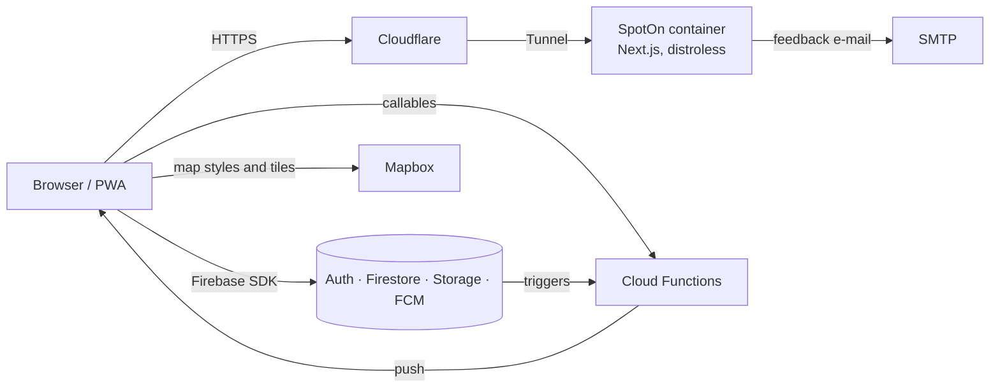

# SpotOn

**Find the places worth going to, and share your own.**

SpotOn is a map of hidden gems picked by the people who use it: viewpoints, quiet parks, date spots, beaches and hiking spots.
You add a place with a few photos, the community rates and saves it, and every spot you contribute levels you up.

- **Live:** https://spoton.isolapaul.hu (installable web app for iOS, Android and desktop)
- **Android:** a Google Play release is planned
- **Languages:** Hungarian, English, German
- **Privacy policy:** https://spoton.isolapaul.hu/privacy · **Terms:** https://spoton.isolapaul.hu/terms

This is a personal project. The code is public so that it can be read; it is not open source (see [License](#license)).

---

## What you can do

- **Explore the map.** Every spot is a pin with its category. Tap one for a place card with the photo, rating and distance, and pull it up for the full page. Choose from five map styles, including satellite.
- **Discover.** Explore lists the spots nearest you or the best rated, filtered by nine categories.
- **Add a spot** with up to 20 photos, which are compressed on your phone before upload. An admin approves new spots before everyone sees them.
- **Review, save and share.** Rate spots, write reviews, add your own photos to other spots, like photos and keep favourites.
- **Level up.** Your 3rd, 10th, 15th and 20th spot each unlock a new level, with a badge, a name colour, highlight slots for your own spots, and at the top level your own name style.
- **Stay in the loop.** Optional push notifications when your spot is approved, reviewed or saved.
- **Own your data.** Delete your account in Settings at any time. See the privacy policy for what is kept and for how long.

---

## How it is built

| Layer | Technology |
|---|---|
| App | Next.js 16 (App Router), React 19, TypeScript, Tailwind CSS, installable PWA |
| Map | Mapbox GL JS |
| State | Zustand |
| Backend | Firebase: Authentication, Firestore, Storage, Cloud Messaging, and Cloud Functions v2 (`europe-west3`) |
| Hosting | Hardened Docker container on a home server, reached through a Cloudflare Tunnel |
| Quality | Vitest unit tests, Firestore/Storage rules tests and Playwright end-to-end tests against the Firebase emulators, in CI on every pull request |


```mermaid
flowchart LR
  U[Browser / PWA] -->|HTTPS| CF[Cloudflare]
  CF -->|Tunnel| APP[SpotOn container<br/>Next.js, distroless]
  U -->|Firebase SDK| FB[(Auth · Firestore · Storage · FCM)]
  U -->|callables| FN[Cloud Functions]
  FB -->|triggers| FN
  FN -->|push| U
  APP -->|feedback e-mail| MAIL[SMTP]
  U -->|map styles and tiles| T[Mapbox]
```

**Security and privacy by design.**
- Every read and write is checked on the server, by the Firestore and Storage rules and the Cloud Functions in this repository, not by the app's UI.
- Pages send a strict, nonce-based Content Security Policy.
- The container runs as a non-root user on a read-only file system, publishes no ports, and is deployed only when its cosign signature verifies.
- All data stays in the EU: Firestore eur3, Storage EUR4, Functions in Frankfurt.
- No ads, no analytics and no tracking cookies.

---

## Repository layout

| Path | What is there |
|---|---|
| `src/app` | Pages (`/`, `/privacy`, `/terms`) and API routes (`/api/feedback`, `/api/firebase-messaging-sw`, `/api/health`) |
| `src/components`, `src/hooks`, `src/store`, `src/lib` | UI, React hooks, Zustand stores with the Firebase calls, and pure unit-tested helpers |
| `src/content/legal` | The privacy policy and terms texts |
| `functions/` | Cloud Functions (see [`functions/README.md`](functions/README.md)) |
| `firestore.rules`, `storage.rules`, `tests/rules/` | Security rules and their tests |
| `e2e/`, `scripts/seed-emulator.ts` | Playwright tests and their emulator fixtures |
| `Dockerfile`, `deploy/`, `.github/workflows/` | Container image, server compose file and update script, CI and the signed release pipeline |
| `docs/deploy.md` | Release and server runbook |
| `docs/BACKLOG.md` | Open work |
| `CLAUDE.md` | Conventions and rules for everyone (people and AI agents) who changes the code |

---

## Development

This is for the owner and invited contributors. Running the app for real needs its own Firebase project; everything below runs against the local Firebase emulators with the demo project `demo-spoton` instead.

Requirements: Node 24 (`.nvmrc`) and Java 21 (for the emulators).

```bash
npm ci && npm --prefix functions ci
npm run verify        # typecheck, lint, unit tests, production build
npm run verify:fn     # Cloud Functions build, lint and unit tests
npm run test:rules    # security rules on the emulators
npm run test:e2e      # Playwright end-to-end tests on the seeded emulators
```

`npm run build` and the e2e tests need the public Firebase config as build-time variables. For the emulators, demo values are enough; see [`CLAUDE.md`](CLAUDE.md) §4.

Releases are `vX.Y.Z` tags. They build, scan, sign and publish the container image, which is then deployed on the server with `./update.sh`. See [`docs/deploy.md`](docs/deploy.md) and [`CHANGELOG.md`](CHANGELOG.md).

---

## Security

Please report vulnerabilities privately through GitHub's private vulnerability reporting (**Security** tab → **Report a vulnerability**), not in a public issue.

## License

Copyright © 2026 Isola Paul Luka. All rights reserved. See [`LICENSE`](LICENSE).
The source code is published for reading only. It may not be copied, modified, redistributed or used, and the SpotOn name and logo may not be used, without written permission.
